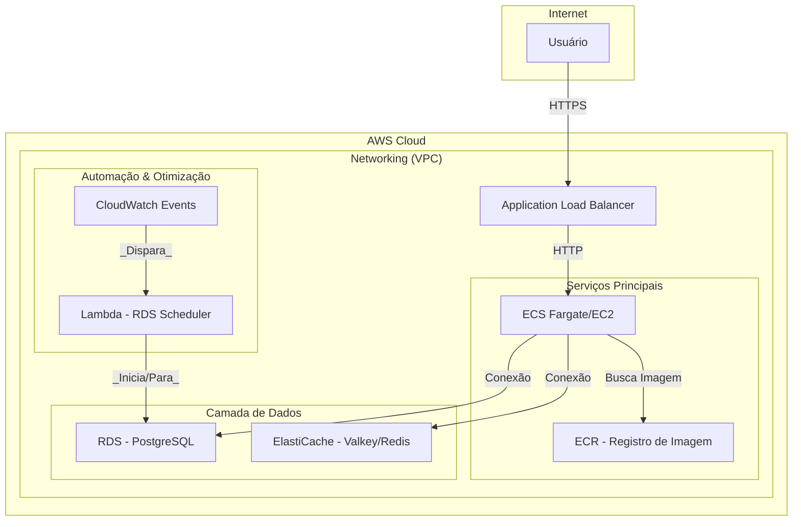

# Plataforma Dolfy - Infraestrutura AWS com Terraform


## ❯ Visão Geral

Este projeto implementa uma infraestrutura completa e escalável na **AWS** para hospedar a **Plataforma Dolfy**, uma aplicação de apostas em contêineres. A infraestrutura é totalmente gerenciada como código utilizando **Terraform**, seguindo uma abordagem modular e reutilizável.

A arquitetura foi projetada para ser flexível, suportando a implantação da aplicação em duas estratégias de computação distintas:
1.  **Amazon ECS (Elastic Container Service) com Fargate:** Uma abordagem serverless para orquestração de contêineres, ideal para escalabilidade e simplicidade operacional.
2.  **Amazon EC2 (Elastic Compute Cloud):** Uma abordagem mais tradicional, implantando os contêineres diretamente em instâncias EC2, oferecendo maior controle sobre o ambiente de execução.

O projeto também inclui recursos de otimização de custos, como um agendador baseado em Lambda para iniciar e parar o banco de dados RDS automaticamente.

## ❯ Arquitetura

O diagrama abaixo ilustra o fluxo da arquitetura principal baseada em ECS:



### Componentes Principais:

*   **Computação:**
    *   **Amazon ECS:** Orquestra os contêineres da aplicação (Nginx, App Node.js, Swagger).
    *   **Amazon EC2:** Alternativa para hospedar os contêineres.
*   **Rede:**
    *   **Amazon VPC:** Ambiente de rede isolado.
    *   **Application Load Balancer (ALB):** Distribui o tráfego de entrada para os contêineres.
*   **Dados:**
    *   **Amazon RDS:** Banco de dados relacional (PostgreSQL) para persistência de dados.
    *   **Amazon ElastiCache (Valkey):** Cache em memória para sessões e dados de acesso rápido.
*   **CI/CD & Contêineres:**
    *   **Amazon ECR:** Armazena as imagens Docker da aplicação.
    *   **Docker:** Tecnologia de contêineres utilizada para empacotar a aplicação.
*   **Otimização de Custos:**
    *   **AWS Lambda & CloudWatch Events:** Automação para ligar/desligar o RDS em horários predefinidos, economizando custos em ambientes de não produção.

## ❯ Tecnologias Utilizadas

-   **Infraestrutura como Código:** Terraform
-   **Cloud Provider:** AWS
-   **Contêineres:** Docker, Docker Compose
-   **Orquestração:** AWS ECS (Fargate/EC2)
-   **Banco de Dados:** AWS RDS (PostgreSQL)
-   **Cache:** AWS ElastiCache (Valkey/Redis)
-   **Aplicação:** Node.js
-   **Reverse Proxy:** Nginx
-   **Documentação de API:** Swagger

## ❯ Estrutura do Projeto

O repositório está organizado da seguinte forma:

```
.
├── Aplicacao-EC2/      # Código-fonte e Dockerfiles da aplicação
│   ├── app/            # Aplicação principal em Node.js
│   ├── app-amazonQ/    # Microserviço em Python
│   ├── nginx/          # Configuração do Nginx como reverse proxy
│   └── swagger/        # Serviço para a documentação da API
├── s3/                 # Configuração Terraform para um bucket S3 (ex: state file)
└── terraform-aws/      # Diretório principal do Terraform
    ├── main.tf         # Arquivo principal que orquestra os módulos
    ├── variables.tf    # Variáveis de entrada do projeto
    ├── outputs.tf      # Saídas da infraestrutura (ex: URL do ALB)
    ├── terraform.tfvars# Valores customizados para as variáveis
    └── modules/        # Módulos reutilizáveis do Terraform
        ├── ec2/
        ├── ecr/
        ├── ecs/
        ├── key-pair/
        ├── networking/
        ├── rds/
        ├── rds-scheduler/
        └── valkey/
```

## ❯ Pré-requisitos

Antes de começar, garanta que você tenha as seguintes ferramentas instaladas e configuradas:

*   [AWS CLI](https://aws.amazon.com/cli/) configurado com credenciais de acesso.
*   [Terraform](https://www.terraform.io/downloads.html) (versão ~> 1.0).
*   [Docker](https://www.docker.com/get-started) e Docker Compose.

## ❯ Como Implantar

1.  **Clonar o Repositório:**
    ```bash
    git clone <URL_DO_SEU_REPOSITORIO>
    cd Dolfy
    ```

2.  **Construir e Enviar as Imagens Docker:**

    Para cada subdiretório em `Aplicacao-EC2` (`app`, `nginx`, `swagger`), execute os scripts para fazer login no ECR, construir a imagem e enviá-la. O Terraform criará os repositórios ECR primeiro.

    *Primeiro, aplique o Terraform para criar os repositórios ECR.*

    ```bash
    # Exemplo para a aplicação principal
    cd Aplicacao-EC2/app
    ./ecr-login.sh
    ./build-push.sh
    cd ../..
    ```
    *Repita o processo para `nginx` e `swagger`.*

3.  **Configurar as Variáveis do Terraform:**

    Navegue até o diretório `terraform-aws`. Renomeie o arquivo `terraform.tfvars.example` (se houver) para `terraform.tfvars` e ajuste as variáveis conforme necessário (ex: `aws_region`, `project_name`).

4.  **Inicializar e Aplicar o Terraform:**

    ```bash
    cd terraform-aws

    # Inicializa os providers e módulos do Terraform
    terraform init

    # Gera o plano de execução
    terraform plan

    # Aplica a infraestrutura
    terraform apply
    ```

5.  **Acessar a Aplicação:**

    Após a conclusão do `terraform apply`, verifique as saídas para obter a URL do Application Load Balancer.

    ```bash
    terraform output alb_dns_name
    ```

## ❯ Módulos do Terraform

O uso de módulos garante que a infraestrutura seja organizada, reutilizável e fácil de manter.

-   **`networking`**: Cria a VPC, subnets, internet gateway, NAT gateway e tabelas de rotas.
-   **`security`**: Gerencia os Security Groups para controlar o tráfego entre os recursos.
-   **`ecr`**: Cria os repositórios no Elastic Container Registry para as imagens Docker.
-   **`rds`**: Provisiona a instância do banco de dados PostgreSQL no RDS.
-   **`valkey`**: Provisiona o cluster de cache em memória.
-   **`ecs`**: Configura o cluster ECS, task definitions e serviços para a aplicação.
-   **`ec2`**: Módulo alternativo para provisionar instâncias EC2.
-   **`key-pair`**: Gerencia chaves SSH para acesso às instâncias EC2.
-   **`rds-scheduler`**: Implanta a função Lambda e as regras do CloudWatch Events para o agendamento do RDS.

## ❯ Otimização de Custos

Uma característica notável deste projeto é o módulo **`rds-scheduler`**. Ele utiliza uma função AWS Lambda, escrita em Python, que é acionada por regras do CloudWatch Events (cron jobs) para parar a instância RDS fora do horário de pico (ex: durante a noite) e iniciá-la no início do dia. Isso reduz significativamente os custos em ambientes de desenvolvimento e homologação.

---
*Este projeto foi desenvolvido como parte do meu portfólio de DevOps, demonstrando habilidades em automação de infraestrutura na nuvem com Terraform e AWS.*
